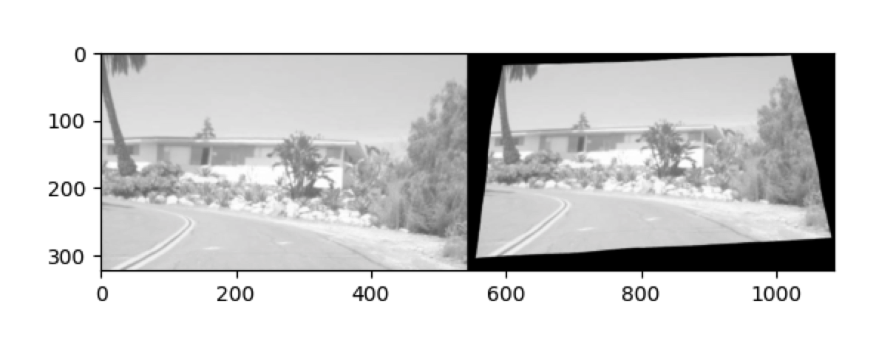

*Complex Deformatation* is an extension transform based on *kornia*.

It consists of two offset-reversible implementations (elastic and perspective).

The package environment is provided in the `requirements.txt`.

Run our sample file `test.py` to learn how to use this extension.

Just like the sample (left: after transform | right: after reverse):

